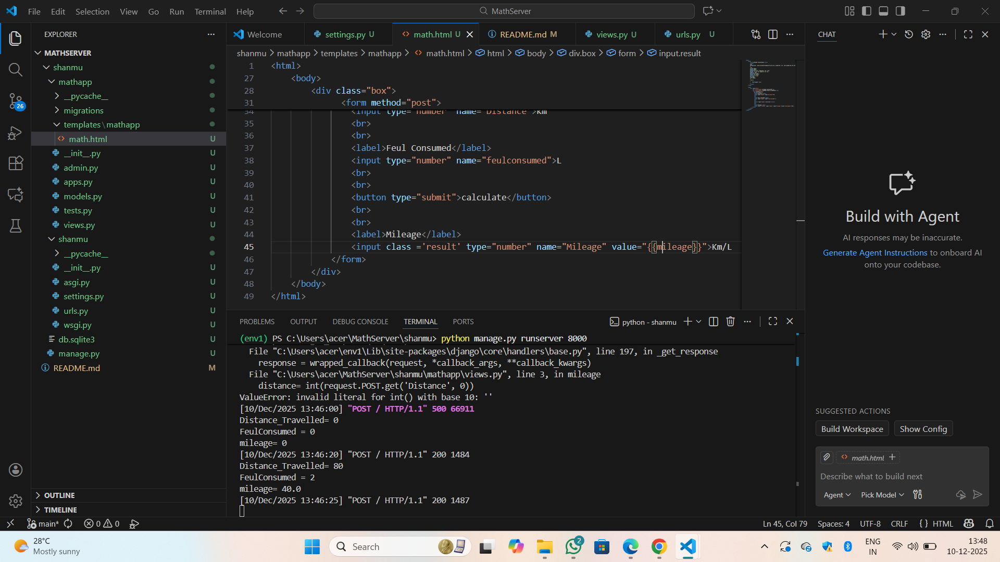

# Ex.04 Design a Website for Server Side Processing
## Date:10-12-2025

## AIM:
To create a web page to calculate vehicle mileage and fuel efficiency using server-side scripts.

## FORMULA:
M = D / F
<br> M --> Mileage (in km/l)
<br> D --> Distance Travelled (in km)
<br> F --> Fuel Consumed (in l)

## DESIGN STEPS:

### Step 1:
Clone the repository from GitHub.

### Step 2:
Create Django Admin project.

### Step 3:
Create a New App under the Django Admin project.

### Step 4:
Create python programs for views and urls to perform server side processing.

### Step 5:
Create a HTML file to implement form based input and output.

### Step 6:
Publish the website in the given URL.

## PROGRAM:
```
math.html
<html>
    <head>
        <title>MILEAGE CALCULATION</title>
        <style>
        body
        {background: linear-gradient(rgba(255,201,225,1),rgb(185, 141, 220),rgba(148,187,233,1));
        }
        .box
        {width:400px;
        height:300px;
        background-color: rgb(255, 123, 123);
        border: dashed 3px rgb(50, 50, 51);
        padding: 10px;
        margin-left:200px;
        margin-top:150px;
        position: fixed;
        top:100px;
        left:300px;
        }
        .result 
        {
            font-weight: bold;
        }
        </style>
    </head>
 
    <body>
        <div class="box">
             <h2 align="center">MILEAGE CALCULATOR</h2>
             <h3 align="center">SHANMUGA PRIYA.K(25004352)</h3>
              <form method="post">
                
                <label>Distance</label>
                <input type="number" name="Distance">km 
                <br>
                <br>
                <label>Feul Consumed</label>
                <input type="number" name="feulconsumed">L
                <br>
                <br>
                <button type="submit">calculate</button>
                <br>
                <br>
                <label>Mileage</label>
                <input class ='result' type="number" name="Mileage" value="{{mileage}}">Km/L
            </form>
        </div>
    </body>
</html>

views.py
import render
def mileage(request):
    distance= int(request.POST.get('Distance', 0))
    feulconsumed=int(request.POST.get('feulconsumed',0))
    mileage = distance/feulconsumed if request.method == 'POST' and feulconsumed!=0 else 0
    print("Distance_Travelled=",distance)
    print("FeulConsumed =",feulconsumed)
    print("mileage=", mileage)
    return render(request,'mathapp/math.html',{'distance':distance,'feulconsumed':feulconsumed,'mileage':mileage})
urls.py
from django.contrib import admin
from django.urls import path
from mathapp import views
urlpatterns = [
    path('',views.mileage,name='mileage'),
]
```


## OUTPUT - SERVER SIDE:
.png>)

## OUTPUT - WEBPAGE:


## RESULT:
The a web page to calculate vehicle mileage and fuel efficiency using server-side scripts is created successfully.
